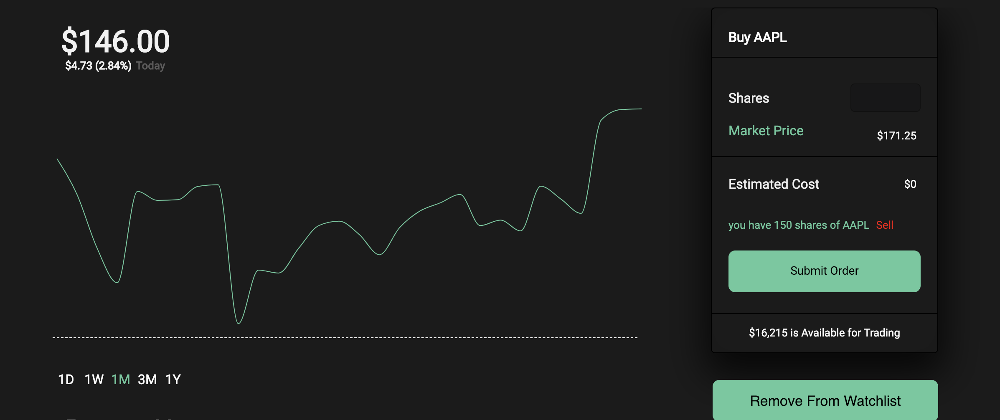

# RobinUblind

*RobinUblind is a single page Robinhood clone made with Rails + React where users are able to purchase and sell stocks, keep a *watchlist, and monitor the value of their portfolio value.

[Live Demo](https://robinublind.herokuapp.com/#/)

## Technologies
* Backend: Rails/ActiveRecord/PostgreSQL
* Frontend: React/Redux
* [IEX API](https://iextrading.com)
* [News API](https://newsapi.org/)
* [Recharts](http://recharts.org/en-US/)

## Features
* Secure Auth pattern with password digests and CSRF protection.
* Real-time data fetched from IEX.
* Interactive charts allowing user to view their portfolio value over time.
* Dashboard featuring watchlists, real-time time stock data and stock related news
* Transaction with industry standard methods and algorithms to calculate portfolio value at any given range
* Quick and easy Search for thousands of stocks listed on the market
* Relevant news stock specific fetched from NewsAPI.

### Dashboard & Portfolio
After logging in, user land on the portfolio page.
<br />
<br />

<br />
<br />

#### Portfolio Snapshots
The chart displayed on the main landing page displays users portfolio value over time. this value is calculated by the backend end. The frontend requests what date range the calculation must be done in based on the selected range. The backend then calculates the portfolio value for every single day in that range. It does so back grabbing all the transactions leading up the the specific day, calculating which positions are open(user has bought more than they have sold) and fetches the stock price for that day. The backend the bundles the data and sends it to the frontend. Here is a snippet of the algorithm.

```rb

def sorted_transactions_upto(dates)
    price_info = {}
    result = []
    ::RestClient.log = Rails.logger #logs api requests inside the rails logger
    
    dates.each do |date|
    #self is User
    self.positions(date).each do |company_code, transaction_array|

      #....

      price_info[company_code] ||= response = RestClient::Request.new({
      method: 'get',
      url: "https://api.iextrading.com/1.0/stock/#{Stock.find_code(company_code)}/batch?types=quote,chart&range=1y",
      headers: { :accept => :json, content_type: :json }
      }).execute do |response, request, result|
        JSON.parse response
      end

        #bundle data in the format of 
        #{
          #closed(displays closed postions):{}
          #open(specifies open position):{data(specific transactions used),
          #stats(data need by frontend),
          #price(price for this slice of time)}

        #}
        #date(the date for this slice)
        hash[:open][Stock.find_code(company_code)] = {
          data: transaction_array,
          stats: User.calculate_holding(transaction_array).merge({
            price: self.find_price_at_date(price_info[company_code]["chart"],date)
          }),
        }
      #...
```

Note that not All information passed along are currently being used, however they were implemented to allow greater flexibility down the road when new features such as transaction history and analysis are added.

### Stock Show Page
The stock show page contains current and historical price information about the stock, and the relevant news. Users are able to purchase and sell stock on this page.the error handling such as "insufficient funds" are all displayed within the submit button. Users can also add and remove items from watchlist. Note that purchasing a stock automatically adds it to the watchlist.



#### Fetching Information
Upon opening the show page of any stock, the front end makes two API request.
  *IEX: Stock price and chart data
  *NewsAPI: Relevant news


to handle JavaScripts asynchronous nature, a thunk is used to change the relevant loading slice of the state, and components are not rendered until data is received and in the Store

```js
//news actions for fetching news data
export const getNews = (subject) => dispatch => {
  dispatch(startReceiveNews()); //changes the loading state
  return NewsUtil(subject).then(response => {
    return dispatch(receiveNews(response.articles))
  })
}

//loading reducer

export default (state =initialState, action) => {
  Object.freeze(state)

  switch (action.type) {
    case START_RECEIVE_NEWS:
      return Object.assign({}, state, { newsLoading: true })
    case RECEIVE_NEWS:
      return Object.assign({}, state, { newsLoading: false})
  //...

```

#### Dynamic Chart Rendering
The charts data range can be dynamically changed by the user. The stock fetch utility used to fetch the stock data take a date range and returns the information needed in that range

```js
export const getStock = (nasdaqcode,range) => {
  return $.ajax({
    method: "get",
    url: `https://api.iextrading.com/1.0/stock/${nasdaqcode}/batch?types=quote,chart&range=${range}`
  })
}
```

The frontend has a state called viewsMode which holds a number indicating the days user is requesting. it also holds has a state for each button in the range indicating with a boolean if the button is selected. The color is calculated based on whether the price of the stock has gone up or down. since the chart needs to have the color information as well, the color property is not bound to state. this is due to the fact that chart calculating color triggers a re render, which triggers a recalculation of color in the buttons, which in turn triggers the chart to calculate color again, starting an infinite loop and stack overflow.

```jsx
  class StockChart extends React.Component{
  
  constructor(props){
    super(props)
    this.state = { viewsMode: 30, d:false,w:false,m:true,tm:false,y:false }
    this.color = 'green'
  }


  //...1D button
   <p onClick={() => {
            this.props.fetchCurrentStock(this.props.stock.quote.symbol, "1d", false).then(() =>{
              this.setState({ viewsMode: 1 });
              this.setState({ d: true, w: false, m: false, tm: false, y: false });
            })
          }}
            className={this.state.d ? `range-selected ${this.color}` : null}
    >1D</p>
```


One of the biggest challenges of this project was updating the displayed value on the top left of the screen based on the mouse hover location on the chart. the challenge was mainly due to the limitations of Recharts. to solved this problem, an unconventional measure was used. a function that updates a ChartData slice in the store was mapped to the props of the chart, and it was placed inside the function the chart used to format its Tooltip data labels. this way, every time Recharts formatted the data to be displayed based on mouse hover location, the data was *dispatched to the store.

```jsx
    const mstop = ({})=> {
    return {}}

    const mapDispatchToProps = (dispatch)=>{
      return{
      updateChartDisplay: (val) => dispatch(updateChartDisplay(val))
            }
      }
    const update = this.props.updateChartDisplay

< LineChart width={710} height={300} data={this.props.data} >
          <Line type="monotone" dataKey="close" stroke={stroke} dot={false} />
          <XAxis dataKey="date" hide={true} />
          <YAxis domain={[min, max]} hide={true} />
          <Tooltip
            contentStyle={{ backgroundColor: 'transparent', border: '0' }}

            formatter={(value) => {
              let returnVal = new Intl.NumberFormat('en-US', {
                style: 'currency',
                currency: 'USD'
              }).format(value);
              update(value); //dispatch happens here
              return <span className="chart-time" >{returnVal}</span>
            }}
            labelFormatter={(value) => {
              if (value.includes("-")) {
                return <span className="chart-time-value">{value}</span>
              } else {
                value = value.replace(/(\d{4})(\d{2})(\d{2})/, "$1-$2-$3");
                return (<span className="chart-time-value">{value}</span>)
              }
            }
            }
            isAnimationActive={false} position={{ y: 270 }} offset={-60}
          />
        </LineChart >)

      //...

export default connect(mstop,mapDispatchToProps)(DrawChart)
```

### Transaction Validation

Transactions Are handles by the backend by first checking the input amount for any errors, checking if user has sufficient funds, and only then attempting to post the transaction to the database. The controller also posts transactions only on the current user, which is validated through session tokens in the backend the backend always returns a JSON message indicating what happened, which is flashed to the user inside the submit button using CSS keyframe animation.

```rb
  #...

    user = current_user
  transaction = Transaction.new

  if user.bankroll.to_i < ((params[:data][:amount].to_i * params[:data][:price].to_i)) && params[:data][:category] == "buy"
    render json: {msg: "insuffient funds",newBankroll: user.bankroll}
    rendered = true
    
  elsif params[:data][:amount].to_i == 0 || params[:data][:amount] == ""
    render json: {msg: "amount must be greater than zero",newBankroll: user.bankroll}
    rendered = true

  #....

  if transaction[:category] == "buy"
        render json: {
          msg: "Buy Successful for #{transaction.amount} shares of #{params[:data][:stock_code]}",
          newBankroll: new_bankroll} unless rendered
  #...


  # current user helper
  def current_user
    return nil unless session[:session_token]
    @current_user ||= User.find_by_session_token(session[:session_token])
  end
```

The final challenge faced during the production was the small charts in the watchlist.mainly, the charts in Robinhood grow during the day as markets open, meaning at the beginning of the day the range of the chart is 9am to 4pm, and the line slowly gets drawn as the day progressed. Recharts only supported doing this using null data, which was not something IEX api supported. to fix this issue, a simple function was used to calculate a percent based on how far into market open the time currently is, with 9am being 1% and 4pm being 100%. this was used to adjust the chart size to the needed length (e.g. at 9:30, the chart is 5% of its full 85 pixels wide)

``` jsx
  const timeone = data[data.length - 1].minute
  const baseline = "9:30"
  const timetwo = "16:00"
  let width = ((totalSeconds(timeone) - totalSeconds(baseline)) / (totalSeconds(timetwo) - totalSeconds(baseline))  ) * 85 //size of container
  if (width > 85) {
    width = 85
  } else if (width < 1){
    width = 1
  }
  
  return (
    < LineChart width={width} height={50} data={data}  >

      <Line type="monotone" dataKey="close" stroke={stroke} dot={false} isAnimationActive={false}/>
      <XAxis dataKey="minute" domain={["9:30", "16:00"]} hide={true} />
      <YAxis domain={[min, max]} hide={true} />
      />
    </LineChart >)
```